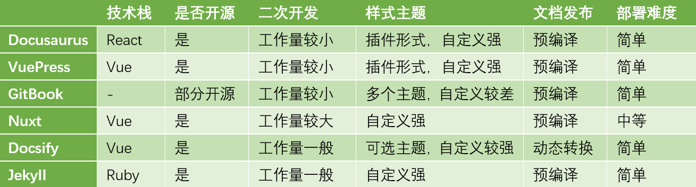

# 前言
静态网站和动态网站相比，比较明显的特征就是其不需要后台服务端支持，仅包含html、js、css前端三剑客。常见的静态网站用途有博客系统，文档管理系统，不过我还看到过有老的新闻网站也用静态系统...谈到博客系统，我又回想起月黑风高的夜晚兴冲冲用hexo搭建自己博客网站的青涩岁月。。。
# 静态网站构建工具
## 简介
静态网站构建工具目前已经有了很多的解决方案，这里我简单罗列几个自己调研的工具并且进行了一些比较。
### [Docusaurus](https://www.docusaurus.cn/) 

Docusaurus是Facebook开源的基于React的静态网站生成器，支持包括文档网站在内的任何类型网站的构建，官网具有详细的文档和大量的应用实例。特点是支持基础模板和插件化，页面级的SEO优化，文档版本化以及全站搜索。其他说明：目前官网提到Docusaurus目前处于alpha测试阶段，在Beat测试之前都建议使用默认主题，这意味着我们后续进行自定义主题组件的时候可能会存在限制。

### [VuePress]()

VuePress是一款由vue驱动的，markdown为项目结构中心的高性能静态网站生成器，是vue生态的组成部分，对集成vue项目的API文档比较契合。它由极简静态网站生成器和默认主题两部分构成，特点是具有较好的加载性能和SEO，支持按需加载，支持自定义主题。

### [GitBook](https://www.gitbook.com/)

GitBook是一款可多人协作的文档平台，项目结构清晰，适合编写API接口文档以及内部知识库，UI层面的自定义较困难，目前可以从固定在几个主题中进行切换。由于版本更新后定位朝着商业化和平台化发展，以前的开源工具CLI目前不再提供了，自定义上优势相对较小。

### [Nuxt](https://zh.nuxtjs.org/)

Nuxt是基于Vue的通用应用框架，预设了服务端渲染的各种配置，主要工作是应用层的UI渲染。Nuxt本质上是一个灵活的应用框架，但是由于它提供了nuxt generate命令，为基于Vue的应用提供生成静态站点的功能。此外，相比于其他方案中文档数据存放在项目本身目录下，Nuxt和其他方案有所差别，它是将md文件单独存放在git仓库并开启静态服务器，然后Nuxt通过axios请求文件数据源，部署起来也要麻烦一些。

### [Docsify](https://docsify.js.org/#/?id=docsify)

Docsify是一个动态生成文档网站的工具，最大的特点是不会将md文档预先编译为静态html，因此在网站运行的时候才会将md动态转换从html，但是这样引起了它弊端即不需要渲染html不利于SEO，其他方面的优势体现在轻量、配置简单、主题多样、支持全文搜索、兼容IE11。
       
## 工具对比

### 二次开发

从二次开发的难度上来说，相对容易的有Docusaurus，VuePress，Docsify，而Nuxt相比前面几个直接集成md文档来的方案来说，工作量会大一点，Gitbook的二次开发支持较少。有Vue基础的话VuePress，Docsify的上手和学习成本更低
    
### 样式自定义
	     
上面列出的几个方案中GitBook对自定义样式的支持相对较差之外，其他均具有较高的样式自定义。Docusaurus目前正处在alpha版本测试，官方暂不建议在beta版本前使用自定义主题替换默认主题。Vuepress自定义的方式可以基于使用的主题进行局部样式覆盖，也可以完全自定义布局组件。
        
### 项目部署
	     
Docusaurus，VuePress，GitBook、Docsify均支持配置文件形式的部署方式，可以方便的部署到Github Pages静态服务器上，通过.gitlab-ci.yml部署到GitLab Page

### 搜索
	     
参考社区的反馈来看，Gitbook搜索功能优秀，Docsify默认支持全文搜索，Docusaurus支持全站搜索，VuePress默认只支持搜索标题，全文搜索需要引入三方工具。
         
# 总结
上述方案中gitbook目前已经偏商业化且自定义较弱，可以作为兴趣尝试。Docusaurus基于React所以对React开发者而言二次开发会比较友好，熟悉Vue的可以尝试VuePress和Docsify。后续会以VuePress为基础介绍下静态网站的自定义与发布，主要是记录下自己学习过程，方便后续回顾。
         
     
         

