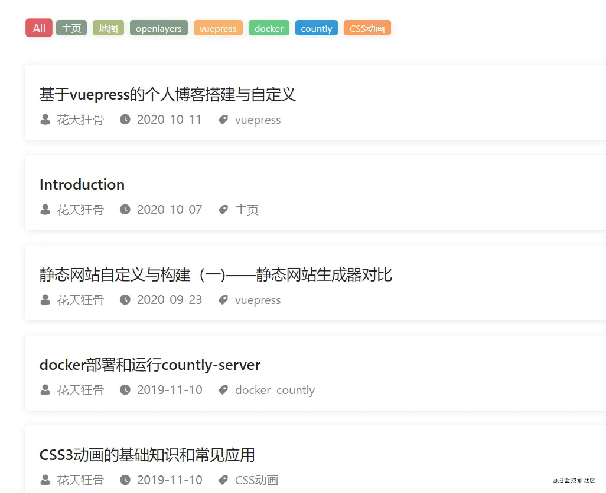

## 前言
很早之前使用hexo搭建的个人博客由于年久失修逐渐被遗忘，为了激励自己多积累多动笔多思考，所以使用vuepress重新搭建个人博客。相比于hexo，vuepress定制起来也更加灵活，对于熟悉vue的前端开发者来说，完全可以编写单页组件并且运用到博客的每个角落，当然博客最终要的还是坚持思考和保持文章积累，个性化的东西说到底只是服务博客本身或者激励自己的一种手段。

## vuepress基础使用
[vuepress](https://vuepress.vuejs.org/zh/)是基于vue的静态网站打包工具，其中最核心的部分就是.vuepress中的config.js，这里面包含了对网站整体的配置，包括顶部的navbar分类，侧边的sidebar文档列表，打包路径等基础配置,全部配置可查看VuePress官网的[配置页](https://vuepress.vuejs.org/zh/config/)。平台搭建过程中的常见问题与解决方法可参考文章[vuepresss建站过程中遇到的一些问题](https://mp.weixin.qq.com/s/UjIrFhfiG5saJYKT53ORBA)

### 安装vuepress

```shell
    yarn add -D vuepress # npm install -D vuepress
```

### 本地运行
```
    npm run dev
```
### 项目打包
```
    npm run build
```

## 博客目录
在空的文档目录下创建一个 .vuepress 目录，所有 VuePress 相关的文件都将会被放在这里。博客根目录下的内容分为.vuepress和文档目录两部分。

1 .vuepress: 用于存储静态资源、核心配置文件、自定义组件、自定义样式等

2 剩余部分为文档目录, 可以通过不同的文件夹分类存储不同类的文档，然后在.vuepress/config.js中可根据文档目录及内容配置网站顶部的nav和左边的sideBar组件

官方推荐的目录结构如下：
```
├── docs
│   ├── .vuepress
│   │   ├── `components`
│   │   ├── `theme`
│   │   │   └── Layout.vue
│   │   ├── `public`
│   │   ├── `styles`
│   │   │   ├── index.styl
│   │   │   └── palette.styl
│   │   ├── `templates`
│   │   │   ├── dev.html
│   │   │   └── ssr.html
│   │   ├── `config.js`
│   │   └── `enhanceApp.js`
│   │ 
│   ├── README.md
│   ├── guide
│   │   └── README.md
│   └── config.md
│ 
└── package.json
```
---

## 博客主题
vuepress博客采用的默认主题vuepress-theme-default, 但是这种风格比较适合文档系统，vue官方文档的主体vuepress-theme-vue就是基于该主题进行的扩展。目前我采用了vuepress-theme-reco作为博客的主体，个人感觉风格还是不错的，比较简约而且拥有分类、标签、时间线等配置

### 博客配置
1. 安装vuepress-theme-reco

``` shell
yarn add vuepress-theme-reco # npm install -D vuepress-theme-reco
``` 
2. .vuepress/config.js中设置主题为vuepress-theme-reco

```js
module.exports = {
    theme: 'reco'
}
```

### 分类和标签
这两个栏目在hexo的时候也有，所以看到reco主题内置categroy和tag时还是比较亲切的
1. 新增markdown时顶部增加Front Matter配置
```
---
categories:
    - CSS
tags: 
    - CSS动画
---
```
2. 修改.vuepress/config.js中的主题配置文件
```js
themeConfig: {
    type: 'blog',
    blogConfig: {
        category: {
            location: 2,     
            text: '分类'
        },
        tag: {
            location: 3,
            text: '标签'
        }
    }
}
```

### 时间轴
1. .vuepress同级目录下增加timeline文件夹，并在其中新增README.md
2. 在README.md增加顶部FrontMatter以及标题, 该md文件会编译时间轴展示页
```
---
isTimeLine: true
sidebar: false
isComment: false
---

## Time Line
```
3. 修改.vuepress/config.js中的主题配置文件
```js
themeConfig: {
    nav: [{ text: 'TimeLine', link: '/timeline/', icon: 'reco-date' }]
}
```

4. 新增markdown时顶部增加Front Matter配置
```
---
date: 2019-11-10
---
```
5. 预览


---

## 博客自定义
本文目前讨论的自定义是基于已有主题的修改,如果想从零开始建立自己的主题可参考vuepress官网的[开发主题](https://vuepress.vuejs.org/zh/theme/writing-a-theme.html)

### 方法一
   目前的自定义是基于已有主题的调整，主要原理是.vuepress/theme目录下的自定义组件会覆盖默认主题中对应的组件。此处以修改vuepress-theme-default默认主题Navbar顶部hover样式为例，默认主题中选中顶部栏目时下划线高亮，但是文本不高亮；个人博客调整navbar选中时文本高亮
  1. 在.vuepress/theme目录下增加index.js入口文件，指定继承的主题。
  ```js
  module.exports = {
      extend: '@vuepress/theme-reco'
  }
  ```
  2. 拷贝vuepress源码默认主题中components目录下的NavLinks.vue至.vuepress/theme/components下
  3. 修改拷贝后的文件NavLinks.vue中增加样式如下
   ```css
   &.router-link-active
        color lighten($accentColor, 8%)
   ```
   3. 保存后执行npm run dev查看效果

### 方法二
.vuepress/styles目录中palette.styl可更改全局样式；index.styl可自定义某一个class, class名可以在浏览器页面审查元素时查看其对应的类名

---

## 博客部署

### 部署到GithubPage
1. .vuepress/config.js中设置打包路径, 默认为.vuepress/dist

```js
module.exports = {
    dest: "dist"
}
```

2. 执行如下命令
``` shell
    # 生成静态文件
    npm run build

    # 进入生成的文件夹
    cd src/dist
    git init
    git add -A
    git commit -m 'deploy'

    # 发布到 https://<USERNAME>.github.io
    git push -f https://<USERNAME>.github.io master
```
3. 预览


## 文档与项目分离
最后，有些情况下我们可能会考虑文档与项目分离的问题，即vuepress核心配置与自定义组件保持不变，文档目录以及相关配置单独放到一个仓库中。这时可以考虑使用git subModule来管理文档子仓库, git submodule详细使用可参考[此处](https://zhuanlan.zhihu.com/p/87053283)

1. 引入子模块，根目录下执行如下命令
```shell
   git submodule add <submodule_url>
```
其中submodule_url是分离后的文档仓库my-blog-docs的地址

2. 每次git clone主仓库后需初始化文档子仓库
```shell
    git submodule init
    git submodule update
```

3. 更新文档子仓库
```
    cd src/my-blog-docs
    git pull origin master
    git add .
    git commit -m [M]子模块文档更新
```
