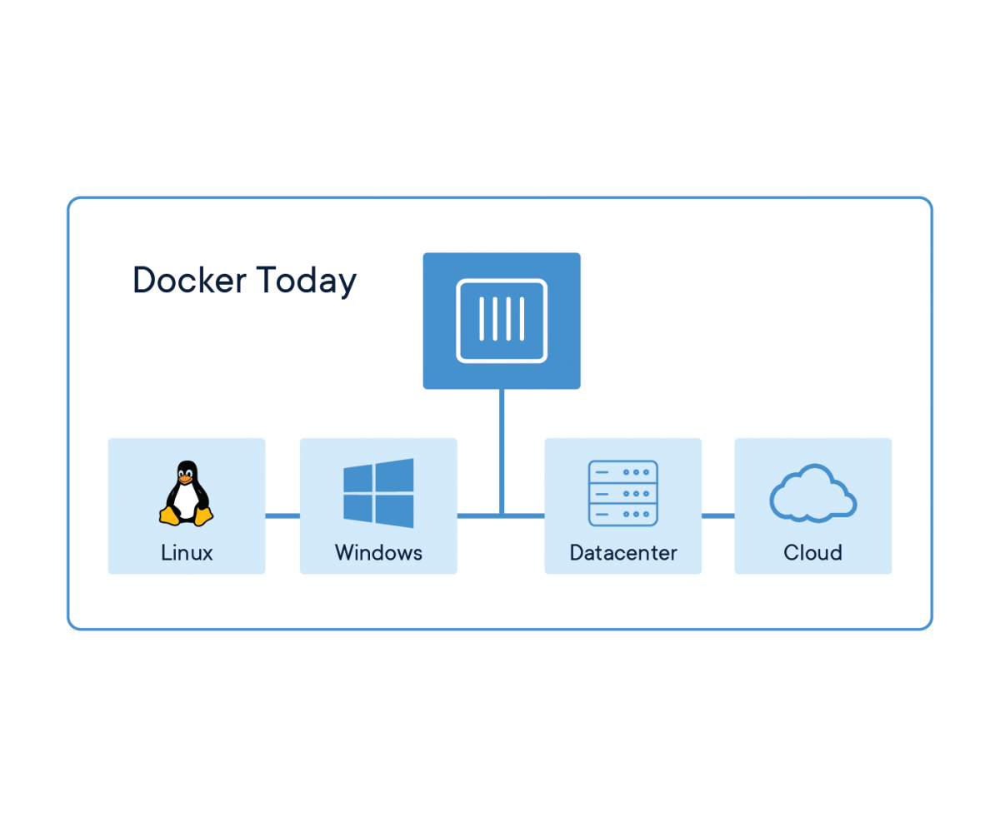

# 1. 前言
最近刚接触和熟悉**countly**，对countly中的crashes插件根据需求进行了部分改动和完善，这篇文章主要记录一下windows10中使用docker容器安装和部署countly-server的整个流程，也算是自己的一些简单的总结和思考
## docker

docker是一个开源的应用容器引擎，容器完全使用沙箱机制，相互之间不会有任何接口影响，可以帮助开发者安全地创建、分享和运行现代化的应用程序。
## countly

countly是开源的数据分析平台，可以一站式收集、展示和分析移动端、客户端等多种来源的数据，以并且它内置了许多插件，可以以此为基础进行个性化开发，也可以根据业务需要完全自定义新的插件

# 2. 安装与配置
## dokcer安装
doker现在支持linux、windows、DataCenter、Cloud等诸多平台，在windows环境下安装和其他软件的安装并无二致，只要按照提示一步步完成即可，这是[网盘下载地址&提取码:eumv](https://pan.baidu.com/s/1nkEjaRqP04hHL-8d-nlWPA)，最新版请移步官网



## 镜像安装与运行
counltly-server运行环境需要在linux下，因此需要安装linux镜像，可以事先在[dockerhub](https://hub.docker.com/search/?q=ubuntu&type=image)官网上搜索


本文选择了docker hub中的ubutun镜像,后面不指定版本号默认下载最新版
> 进入docker的安装目录, 使用docker命令下载ubuntu
```
    // download latest ubuntu
    docker pull ubuntu
```

> docker运行ubuntu：-i: 以交互式方式运行，-t: 终端，-p:端口映射，-v: 文件目录映射（windows目录：ubuntu目录)
```
    docker run -ti -p 6001:6001 -v /c/countly-server:/countly/countly-server ubuntu bash
```


## ubuntun下countly-server配置
### mongodb安装
* 方法一（可能会落后官网的版本）
```
    apt-get update
    apt-get install mongo
```

* 方法二（直接从官网下载解压）：
>进入到[mongoDB 下载页面](https://www.mongodb.com/download-center/community),切换到【*MongoDB Community Sever*】选择版本、操作系统、安装包格式等，下方会出现下载地址


```
    # 更新
    apt-get update 
    # 下载curl
    apt-get install curl 
    # 下载mongodb官网对应linux版本的压缩包
    get curl -O https://fastdl.mongodb.org/linux/mongodb-linux-x86_64-ubuntu1804-4.2.1.tgz
    # 解压mongo压缩包
    tar -zxvf mongodb-linux-x86_64-ubuntu1804-4.2.1.tgz
    # 移动解压文件到全局安装目录
    mv mongodb-linux-x86_64-ubuntu1804-4.2.1.tgz  /usr/local/mongodb
    # 设置path路径
    export PATH=/usr/local/mongodb/bin:$PATH
```

nodejs安装
* 方法一：
```
    apt-get update
    apt-get install nodejs
```
* 方法二：
从[nodejs官网](https://nodejs.org/en/)下载安装包，具体步骤和mongodb安装类似

### 端口配置
* mongodb：*27017* 。
* dashboard: *6001*

### 启动counlty-server
启动过程中涉及到数据库、接口服务、dashboard页面多个命令行会话，这里可考虑使用screen进行多窗口的分屏，这样可在多个会话之间自由切换
```
    apt-get install screen
```
1. start mongodb(启动mongodb):
```
    # 新建mongodb
    screen -S mongodb
    # 启动mongodb
    mongod --dbpath=/countly/mongodb/data --logpath=/countly/mongodb/log/mongo.log --logappend
```
2. start api(启动api)
``` 
    # 新建api服务会话
    screen -S api
    # 进入到countly-server目录
    cd countly/countly-server
    # 启动countly的api接口服务
    DEBUG=development supervisor node api/api.js
```
3. start dashboard(启动dashboard)
```
    # 新建dashboard会话
    screen -S dashboard
    # 进入到countly-server目录
    cd countly/countly-server
    # 启动countly-server主项目
    NODE_ENV=development supervisor node frontend/express/app.js
```
4. 浏览器访问localhost:6001


本文只是做一个简单的记录方便后续回顾，刚开始些博客之类的文章，不足之处也欢迎大家指正
