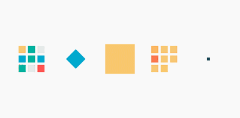

<!-- 图片采用本地加载，无本地图片取消注释可加载在线图片 -->
## **前言**
前端动画的出发点通常都是增强前端整体内容的表现形式、丰富交互手段，以改善用户体验，目前前端动画实现方式主要有下面三种方式

1. HTML5中调用绘图api：Canvas

2. JavaScript中使用定时器：setTimeout(), setInterval()、requestAnimationFrame()

3. CSS3中transition, animation属性

<br/>

***

<br/>

## **基础知识**
CSS3中动画也叫做关键帧动画可以分为<font color='#3a90f6'>***transition***</font>(过渡动画)和<font color='#3a90f6'>***animation***</font>(动画)两种，两者实现方式是相似的，都是随着时间变化改变元素的属性值，但是适用的场景是不同的。主要区别如下：

* **触发方式:** transition是基于事件驱动的，必须触发事件才会执行，而animation则不需要显示的触发事件

* **关键帧:** transition只有开始&结束两个关键帧，不需要过多关注中间过程；而animation则可以通过百分比自定义更多的中间状态

* **循环:** transition通常执行一次，多次循环需要指定transitionEnd处理事件，较繁琐；animation可以直接指定循环次数

<br>

### <font color='#3a90f6'>**transition**</font>
 transition属性是CSS3中的过渡动画，它是一个简写属性，用于设置四个过渡属性
``` 
    transition: property duration timing-function delay;
```

| value                        | description          |
|------------------------------|----------------------|
| transition\-property         | 规定设置过渡效果的 CSS 属性的名称。 |
| transition\-duration         | 规定完成过渡效果需要多少秒或毫秒。    |
| transition\-timing\-function | 规定速度效果的速度曲线。         |
| transition\-delay            | 定义过渡效果何时开始。          |
*默认值： transition: all 0 ease 0*

>### <font color='#3a90f6'>**time-function**</font>
>
>>transition和animation属性中都存在time-function属性，time-function描述了在一个过渡或动画中一维数值的改变速度。这实质上让你可以自己定义一个加速度曲线，以便动画的速度在动画的过程中可以进行改变。这些函数通常被称为缓动函数(easing functions),主要有<font color='#3a90f6'>**cubic-bezier()**</font>立方贝塞尔曲线的子集和<font color='#3a90f6'>**step()**</font>阶梯函数两种。
>>
>>**常见的动画速度曲线**
>>
>>贝塞尔曲线函数
>>* linear: 匀速,规定以相同速度开始至结束的过渡效果, `cubic-bezier(0,0,1,1)`
>>* ease: 规定慢速开始，然后变快，然后慢速结束的过渡效果, `cubic-bezier(0.25,0.1,0.25,1)`
>>* ease-in: 先慢后快,规定以慢速开始的过渡效果，`cubic-bezier(0.42,0,1,1)`
>>* ease-in-out：规定以慢速开始和结束的过渡效果，` cubic-bezier(0.42, 0.0, 0.58, 1.0)`
>>* ease-out：规定以慢速结束的过渡效果 `cubic-bezier(0.0, 0.0, 0.58, 1.0)`
>>
>> 阶梯函数
>>
>>steps(number_of_steps, direction)
>>* step(n, start): 动画开始时第一步正好开始
>>* step(n, end): 动画结束时最后一步正好结束
<br/>

### <font color='#3a90f6'>**animation**</font>
animation属性是CSS3中的动画，它是一个简写属性，用于设置六个动画属性
> Internet Explorer 9 以及更早的版本不支持 animation 属性
```
    animation: name duration timing-function delay iteration-count direction;
```
| value                       | description             |
|-----------------------------|-------------------------|
| animation\-name             | 规定需要绑定到选择器的 keyframe 名称 |
| animation\-duration         | 规定完成动画所花费的时间，以秒或毫秒计     |
| animation\-timing\-function | 规定动画的速度曲线               |
| animation\-delay            | 规定在动画开始之前的延迟            |
| animation\-iteration\-count | 规定动画应该播放的次数(n or infinite)        |
| animation\-direction        | 规定是否应该轮流反向播放动画(normal or alternate)       |

*适用元素： 所有基础dom元素 & 伪元素（::before、::after）*

**示例**
```css
    div {
        animation: mymove 5s ease-in-out infinite alternate
    }
```
<br/>

### <font color='#3a90f6'>**keyframe**</font>
创建动画的原理是，将某一种 CSS 样式随着时间推进逐渐变为另一套样式。@keyframes 通过指定动画中特定时间点必须展现的关键帧样式来控制CSS动画的中间环节。
```
    @keyframes animationname {keyframes-selector {css-styles;}}
```
| value               | description                                          |
|---------------------|------------------------------------------------------|
| animationname       | 定义动画的名称。                                             |
| keyframes\-selector | 动画时长的百分比。合法的值：0\-100% ,from, to
| css\-styles         | 一个或多个css样式                                           |

**示例**:
```css
    @keyframes mymove
    {
        0%   {top: 0px;}
        50%  {top: 100px}
        100% {top: 200px;}
    }
```

<br/>

### <font color='#3a90f6'>**vue中的过渡与动画**</font>
#### 1. transition组件
```html
    <div id="demo">
        <button v-on:click="show = !show">Toggle</button>
        <transition>
            <p v-if="show">hello</p>
        </transition>
    </div>
```
transition组件包裹的元素在插入或者删除时可以进行一些过渡处理，其工作方式如下：

(1) 自动检测目标元素是否应用了 CSS 过渡或动画，如果是，在恰当的时机添加/删除 CSS 类名。

(2) 如果过渡组件提供了 JavaScript 钩子函数，这些钩子函数将在恰当的时机被调用。

(3) 如果没有找到 JavaScript 钩子并且也没有检测到 CSS 过渡/动画，DOM 操作 会在下一帧中立即执行

过渡的类名（6个）：

<!--  -->

* v-enter: 定义进入过渡的开始状态
* v-enter-active：定义进入过渡生效时的状态
* v-enter-to: 定义进入过渡的结束状态(>v.2.1.8)
* v-leave: 定义离开过渡的开始状态
* v-leave-active：定义离开过渡生效时的状态
* v-leave-to: 定义离开过渡的结束状态(>v.2.1.8)
#### 2. css过渡
```css
    .v-enter-active {
        transition: all .3s ease;
    }
    .v-leave-active {
        transition: all .8s cubic-bezier(1.0, 0.5, 0.8, 1.0);
    }
    .v-enter, .v-leave-to {
        transform: translateX(10px);
        opacity: 0;
    }
```
#### 3. css动画
```css
    .v-enter-active {
        animation: bounce-in .5s;
    }
    .v-leave-active {
        animation: bounce-in .5s reverse;
    }
    @keyframes bounce-in {
        0% {
            transform: scale(0);
        }
        50% {
            transform: scale(1.5);
        }
        100% {
            transform: scale(1);
        }
    }
```

## **常见应用**
### 【hover动画】
hover动画通常是用css transition实现，因为它需要触发事件，并且没有复杂的中间状态。

实现原理： transition


### 【加载动画】

实现原理：transform、 transition（ transform主要是一些图形变换，如旋转、拉伸、缩放等）




### 【人物动画】
实现原理：css sprite（雪碧图）、background-position、animation、steps()


