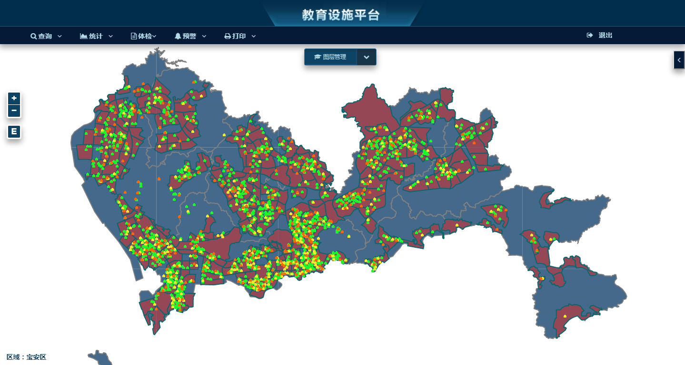
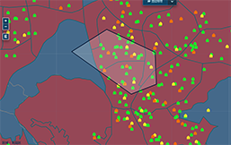
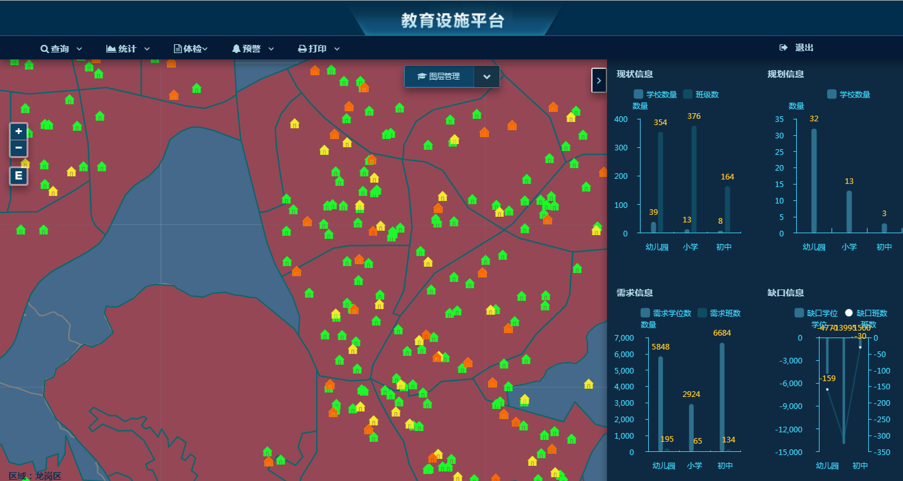
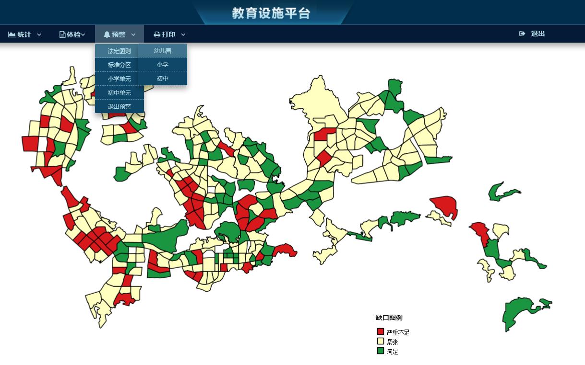

## 简介
这个项目是研究生阶段的工作，内容是南方某市的一个教育数据和规划数据结合后的web端可视化，主要是实现基于电子地图的学校要素信息查询，自定义多边形指标统计,各区域学校缺口的预警以及地图输出等功能，在梳理项目思路之前我先贴一下目前的效果图：

## 实现思路
这个项目总体的思路是OpenLayers（浏览器地图渲染、要素交互）+ QGIS（样式配置）+GeoServer（地图服务器数据切片）+Tomcat（应用服务器）。OpenLayers是开源web端的地图开发框架，能够实现OGC规范下的在线地图服务（WMS/WFS、WMTS等）的调用，也能针对矢量数据进行平移、结点编辑等操作；QGIS是一个开源的本地GIS软件，可以进行地图样式SLD文件的导出（我没记错的话ArcGIS导出SLD需要安装其他插件才能导出SLD）;GeoServer和Tomcat构成了服务器，我的实验部分是采用war包形式的GeoServer放到Tomcat解压的方式，更加方便快捷。主要的技术路线就说到这（都是比较成熟的技术。。。）

## 关键问题
数据的可视化只是基础，真正核心的部分是空间查询和空间分析这一块。所以接下来就项目针对这两个方面进行说明。功能需求中的第一个问题，提出按照自定范围查询该范围内的所有数据并进行统计，先看一下效果：

### 问题1 基础实现步骤
第一步，GeoServer通过shp格式的源数据进行地图服务的发布，在发布过程中应当注意坐标系的选择和缓存切片的问题，细节就不再赘述；

第二步，OpenLayers提供了 DrawBox的方法绘制多边形，在完成绘制之后既可将其看作是一个多边形面要素(feature)，所有的OpenLayers声明的feature类实例都具有getGeomtry方法，它返回Geometry对象，通过这个Geometry对象的getExtent(）方法就可以获取到构成该自定义范围的多点串坐标；

第三步，也就是开始查询的关键一步，确定了这个坐标范围（这里简称bbox）,我们就可以通过GeoServer发布服务进行调用了（url也就类似http://localhost/geoserver/demo/wfs然后进行参数拼接），空间查询的话确定好图层名typename、service类型、srs值、request请求类型、bbox的值就可以了（ 具体参数可查询OGC规范）；如果是属性查询，就额外需要用到cql_filter参数，比如我要查询的是name属性为“A”的记录，则 cql_filter= "name=A"; 然后以键值对的形式拼接在URL后面。

### 问题2 基于分层设色的预警方案
在浏览器端如果要进行要素样式在首次渲染之后还能更改，那么加载的数据的图层必须是WFS类型的。但是在GeoJson作为数据格式传输的时候数据量过大，WFS服务造成浏览器产生卡顿，加载速度慢等性能问题。这里有考虑矢量切片的方案，但是OpenLayers对于矢量切片的图层样式还是只能view不能change, 即你可以在JavaScript中加载图层时初始化样式，但是在加载结束之后你不能再去修改样式。。。

因此我最终还是选择了QGIS进行本地分层设色，导出SLD文件,Geoserver发布sld样式后，再发布shp文件，然后通过sld去渲染wms服务最终形成切片，前端的话通过脚本获取不同点击事件然后去调用相应的GeoServer的渲染好的wms切片服务。（注意GeoServer发布时勾选png、jpg即可在浏览时自动切片成相应

### 问题3 浏览器的性能问题和矢量切片问题

一般来说，浏览器加载wms服务时（本质上就是栅格图片）已经通过切片的手段优化过了，基本不存在突出的性能问题；但是加载大量数据的然后矢量化渲染在地图上时，这时候性能问题就比较突出了。因此有的前辈也提出了将切片思想应用到矢量数据，仅返回当前窗口地图范围内的GeoJSON数据，以免地图范围一变化地图就重新全部请求。当然现在GeoServer已经有了类似的插件，可以发布GeoJSON、TopoJSON等格式的矢量切片；只是OpenLayers目前还没有将矢量切片的图层等同于传统的矢量图层，尽管点选查询之类的操作可以直接在浏览器端执行，不用进行后台请求；但是对其图层要素的样式或者属性进行更改、编辑、更新还是不支持。最后引用下OpenLayers官网对矢量切片的描述：【Although this source receives tiles with vector features from the server, it is not meant for feature editing. Features are optimized for rendering, their geometries are clipped at or near tile boundaries and simplified for a view resolution. See ol.source.Vector for vector sources that are suitable for feature editing.】