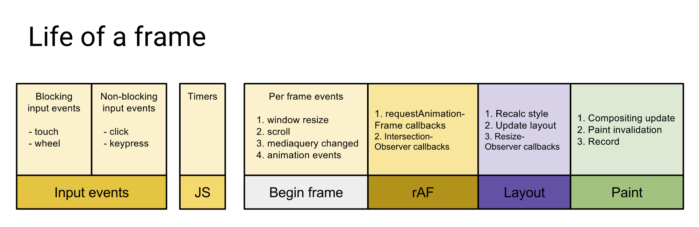

## 背景-同步代码的执行上下文与执行栈
1. 自我描述
执行一段js脚本时，首先会创建全局执行上下文且将其推入执行上下文栈，然后依次开始执行代码，当执行到函数时会创建该函数的执行上下文并推入执行上下文栈中，然后进入该函数执行上下文中执行相应的逻辑，遇到新的函数时会重复上述过程。当函数执行完成时函数执行上下文栈会对该执行上下文进行出栈操作并销毁，从而退回到上一级的执行上下文中继续往下执行代码。

2. 引用他人的解释
> 当一个脚本第一次执行的时候，js引擎会解析这段代码，并将其中的同步代码按照执行顺序加入执行栈中，然后从头开始执行。如果当前执行的是一个方法，那么js会向执行栈中添加这个方法的执行环境，然后进入这个执行环境继续执行其中的代码。当这个执行环境中的代码 执行完毕并返回结果后，js会退出这个执行环境并把这个执行环境销毁，回到上一个方法的执行环境。。这个过程反复进行，直到执行栈中的代码全部执行完毕。 

## 事件循环机制

1. 执行一段脚本，对于同步代码会按照上述的执行栈的入栈出栈操作一次执行。
2. 遇到异步代码时由于js是非阻塞的，因此不会等待返回结果，而是将这个事件挂起后继续执行下面的同步代码
3. 当异步函数返回结果时，我们会将其回调加入事件队列（Task Query），当时该队列不会立即执行回调函数，而需要等执行栈的代码都执行结束，主线程空闲出来才会执行相应的事件队列。
4. 事件队列中分为任务分为宏任务和微任务，当主线程空闲时会先查看微任务队列是否由事件存在，如果存在则会依次放入执行栈中执行直到微任务队列为空；若不存在则从宏任务队列中取出一个对应的回调函数放到执行栈中。

> 当前执行上下文栈执行完毕为空时，会优先处理所有微任务队列中的事件；然后从宏任务中取出最顶部的事件。同一次循环中微任务的处理都在宏任务之前。

常见的微任务：Promise.then() process.nextTick() MutationObserver()
常见的宏任务：setTimeout()、setInterval() 

## 新的理解（2021-06-14）
### 概念
事件循环机制是宿主环境为了综合调度ui渲染和js执行，也为了处理js执行时高优先级的任务而设计的机制。

### 一次event loop流程(可以看成一帧)
1. 执行宏任务（setTimeout()、setInterval()）
2. 执行所有微任务（Promise.then()、MutationObserver()），属于高优先级的任务插件机制
3. check是否需要渲染
    * 开始渲染前，执行requestAnimationFrame回调
    * 执行IntersectionObserver回调
    * 当前线程，切换到渲染线程。
4. 检查是否需要执行worker
5. check结束时根据距离下一帧刷新是否还有时间来决定，是否执行requestIdleCallback

